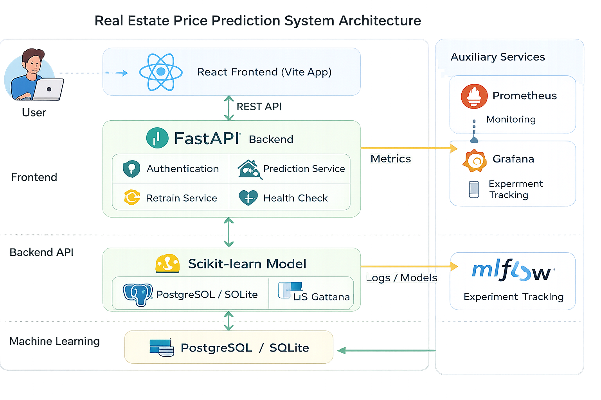

# 🏠 Real Estate Price Prediction System

<p align="center">


</p>

A **production-ready full-stack Machine Learning application** that predicts real estate prices using advanced regression models with a modern web interface, secure authentication, monitoring, and cloud-ready deployment.

---

## 🚀 Features

✅ Real-Time House Price Prediction

✅ FastAPI REST API

✅ React + Vite Frontend

✅ JWT Authentication

✅ Model Retraining API

✅ Scikit-Learn Regression Models

✅ PostgreSQL / SQLite Support

✅ Docker & Docker Compose

✅ Prometheus + Grafana Monitoring

✅ MLflow Experiment Tracking

✅ Kubernetes & Terraform Deployment

---

# 🏗️ System Architecture



```text
docs/
└── architecture.png
```

```md

```

---

# 📂 Repository Structure

```text
Real-Estate-Price-Prediction-System

├── backend/          # FastAPI backend
├── frontend/         # React + Vite frontend
├── ml-pipeline/      # ML training pipeline
├── infrastructure/   # Kubernetes + Terraform
├── monitoring/       # Prometheus + Grafana
├── scripts/          # PowerShell helpers
├── docs/             # Architecture & screenshots

├── README.md
├── ARCHITECTURE.md
├── API_REFERENCE.md
├── SYSTEM_DESIGN.md
├── CHANGELOG.md
├── CONTRIBUTING.md
└── LICENSE
```

---

# ⚡ Tech Stack

### Frontend

* React
* Vite
* Axios
* React Router

### Backend

* FastAPI
* SQLAlchemy
* Pydantic
* JWT Authentication

### Machine Learning

* Scikit-Learn
* Pandas
* NumPy
* Joblib

### Database

* PostgreSQL
* SQLite

### Monitoring

* Prometheus
* Grafana
* Alertmanager

### DevOps

* Docker
* Docker Compose
* Kubernetes
* Terraform

---

# ✨ Key Features

## 🔐 Authentication

* JWT Authentication
* Secure Password Hashing
* Role Based Access Control

---

## 🏡 House Price Prediction

* Multiple Regression Models

  * Linear Regression

  * Random Forest

  * Gradient Boosting

  * XGBoost

* Real-time predictions

* Feature preprocessing

* Model comparison

---

## 📈 Monitoring

Integrated observability stack:

* Prometheus Metrics

* Grafana Dashboards

* Alertmanager

* Health Checks

---

## 🧠 Machine Learning Pipeline

The training pipeline performs:

* Dataset Loading

* Data Cleaning

* Missing Value Handling

* Outlier Removal

* Feature Engineering

* Model Training

* Hyperparameter Tuning

* Model Comparison

* Artifact Export

Generated artifacts:

```text
ml-pipeline/tracking/

├── model.joblib

├── results.json

├── feature_importance.png

└── mlruns/
```

---

# 🚀 Quick Start

## 1. Clone Repository

```bash
git clone https://github.com/omchaudhari602/Real-Estate-Price-Prediction-System.git

cd Real-Estate-Price-Prediction-System
```

---

## 2. Create Environment

```powershell
cp .env.example .env

python scripts/generate_env.py
```

---

## 3. Create Virtual Environment

```powershell
python -m venv .venv

& .venv\Scripts\Activate.ps1

pip install -r backend/requirements.txt
```

---

## 4. Generate Example Model

```powershell
python scripts/generate_example_model.py
```

---

## 5. Start Backend

```powershell
cd backend

uvicorn main:app --reload --host 0.0.0.0 --port 8000
```

Backend:

```text
http://localhost:8000
```

Swagger Docs:

```text
http://localhost:8000/docs
```

---

## 6. Start Frontend

```powershell
cd frontend

npm install

npm run dev
```

Frontend:

```text
http://localhost:3000
```

---

# 🐳 Docker Deployment

Start the complete stack:

```powershell
scripts/start_stack.ps1
```

or

```powershell
docker compose up --build
```

---

### Available Services

| Service      | Port |
| ------------ | ---: |
| Backend      | 8000 |
| Frontend     | 3000 |
| PostgreSQL   | 5432 |
| Redis        | 6379 |
| Prometheus   | 9090 |
| Grafana      | 3001 |
| Alertmanager | 9093 |
| MLflow       | 5000 |

---

# 📚 Documentation

* 📖 API Reference → `API_REFERENCE.md`

* 🏗️ Architecture → `ARCHITECTURE.md`

* ⚙️ System Design → `SYSTEM_DESIGN.md`

* 📜 Changelog → `CHANGELOG.md`

* 🤝 Contributing → `CONTRIBUTING.md`

---

# 🧪 Testing

Run backend tests:

```powershell
pytest backend -q
```

Run coverage:

```powershell
pytest --cov
```

---

# 🔮 Future Improvements

* Redis Caching

* Kubernetes Deployment

* AWS Deployment

* CI/CD Pipeline

* Model Versioning

* Feature Store

* A/B Testing

* Async Prediction Queue

* Explainable AI (SHAP)

---

# 👨‍💻 Author

**Om Chaudhari**

Data Science Undergraduate

Interested in:

* Machine Learning

* Generative AI

* MLOps

* Full Stack AI Applications

---

⭐ If you found this project useful, consider giving it a star.
